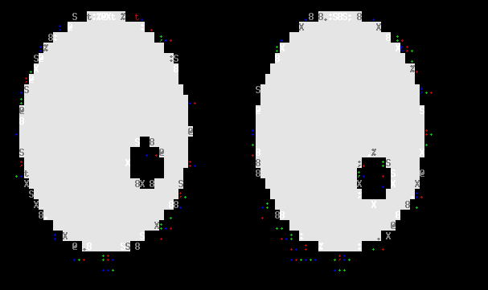

# Xcaca

An X11 server that renders its framebuffer as ASCII art in your terminal, powered by [libcaca](http://caca.zoy.org/).

Run regular X11 GUI applications as terminal art over SSH, in headless environments, or just for the aesthetic.



Built on the Kdrive/TinyX framework (same architecture as Xephyr). No root required.

## Requirements

- Currently targets Ubuntu 24.04 and derivatives (e.g. Linux Mint 22.3). Completely untested and unspported on other distros, but if you wanna send in a pull request to improve cross-distro support I'd welcome it.
- libcaca (`libcaca-dev`)
- meson + ninja
- xorg-server build dependencies

## Install dependencies

```bash
sudo apt install meson ninja-build libcaca-dev
sudo apt build-dep xserver-xephyr
```

## Build

```bash
cd xorg-server
meson setup builddir \
    -Dxcaca=true \
    -Dxephyr=false \
    -Dxorg=false \
    -Dxvfb=false \
    -Dxnest=false \
    -Dglx=false \
    -Dsecure-rpc=false
ninja -C builddir
```

Binary: `xorg-server/builddir/hw/kdrive/caca/Xcaca`

## Usage

Xcaca takes over the terminal it runs in to display ASCII art, so it **must run in the foreground** — backgrounding it with `&` causes `SIGTTOU` and immediately stops the process. Use two terminals or a tmux split:

```bash
# Terminal 1 (or tmux pane): Xcaca renders here
./xorg-server/builddir/hw/kdrive/caca/Xcaca :1 -screen 640x480

# Terminal 2 (or another tmux pane): run X clients
DISPLAY=:1 xeyes
DISPLAY=:1 xclock
DISPLAY=:1 xterm
```

### Options

| Option | Description | Default |
|--------|-------------|---------|
| `-screen WxH` | Framebuffer resolution | `640x480` |
| `-dither <alg>` | Dither algorithm: `none`, `ordered2`, `ordered4`, `ordered8`, `random`, `fstein` | `fstein` |
| `-charset <set>` | Character set: `ascii`, `blocks`, `shades`, `utf8`, ... | `ascii` |
| `-brightness <f>` | Brightness multiplier | `1.0` |
| `-gamma <f>` | Gamma correction | `1.0` |
| `-contrast <f>` | Contrast adjustment | `1.0` |
| `-cell-aspect <f\|auto>` | Terminal cell width/height ratio | `auto` |

### Output driver

Xcaca uses libcaca for rendering. The driver is auto-selected but can be overridden via the `CACA_DRIVER` environment variable:

| Driver | Description |
|--------|-------------|
| `ncurses` | ncurses terminal (default, best compatibility) |
| `slang` | S-Lang terminal (fallback) |

```bash
CACA_DRIVER=slang Xcaca :1 -screen 640x480
```

### Examples

In each case, run Xcaca in one terminal and the X client in another:

```bash
# Blocks charset looks great for UI elements
Xcaca :1 -screen 320x240 -charset blocks   # terminal 1
DISPLAY=:1 xlogo                            # terminal 2

# Force Floyd-Steinberg dither with boosted contrast
Xcaca :1 -screen 640x480 -dither fstein -contrast 1.4
DISPLAY=:1 xterm

# Ordered dither — faster, retro look
Xcaca :1 -screen 640x480 -dither ordered4 -charset shades
```

### Cell aspect ratio

Most terminals use cells that are roughly twice as tall as wide (aspect ratio ≈ 0.5). Xcaca auto-detects this via `TIOCGWINSZ` at startup.

If the output looks stretched or squished, override manually:

```bash
# Typical terminal (8×16 cells)
Xcaca :1 -cell-aspect 0.5

# Square cells (rare)
Xcaca :1 -cell-aspect 1.0

# Auto-detect from terminal
Xcaca :1 -cell-aspect auto
```

## Known limitations

- **Mouse precision** is limited to terminal cell granularity (~8×16 px per cell)
- **Input latency** of ~16ms (caca events are polled in the server's block handler — no fd to select on)
- **Key mapping is lossy**: dead keys, AltGr, and compose sequences don't work through a terminal
- **No GPU acceleration** — pure software rendering
- **Single screen** only
- **Ctrl+C shutdown hangs**: pressing Ctrl+C begins shutdown but the process blocks until something connects to the X socket. Workaround: `pkill -x Xcaca` from another terminal

## How it works

Xcaca is a Kdrive backend that:
1. Allocates a 32bpp ARGB framebuffer in memory
2. Exposes it as a standard X11 display (any X client can connect)
3. On each server cycle, checks for framebuffer damage
4. When damaged, calls `caca_dither_bitmap()` to convert the framebuffer to ASCII art
5. Refreshes the terminal display with `caca_refresh_display()`

Input events (keyboard, mouse) are polled from libcaca and translated to X11 input events via evdev scancodes.

## Architecture

```
X client (xeyes, xterm, ...)
    ↕ X11 protocol
Xcaca server
    ├── 32bpp ARGB framebuffer (malloc'd)
    ├── Damage tracking (fires on client rendering)
    ├── caca_host.c — libcaca abstraction
    │   ├── caca_dither_bitmap() → ASCII art
    │   └── caca_get_event() → keyboard/mouse
    └── cacainput.c — evdev scancode translation
```

## Licensing

**Xcaca** is licensed under the [X11 License](LICENSE).

Xcaca is built on:
- **xorg-server** ([X11 License](https://gitlab.freedesktop.org/xorg/xserver/-/blob/master/COPYING)) — compatible source license
- **libcaca** ([GPLv2](http://caca.zoy.org/)) — the compiled binary inherits GPLv2 obligations

The source code can remain under its original X11 license, but the compiled Xcaca binary is effectively GPLv2 due to libcaca linking. See [GPL linking](https://www.gnu.org/licenses/gpl-faq.html#SourceCodeForm) for details.
